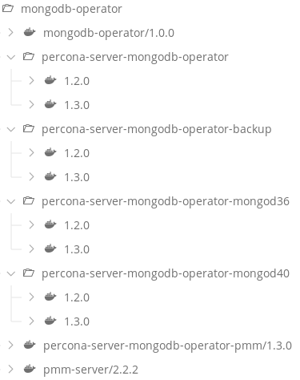

# mongodb-operator (cluster admin actions)

## Overview

This README provides instructions for a cluster aministrator to install the [Percona](https://github.com/percona/percona-server-mongodb-operator) Server MongoDB Operator Custom Resource Definitions (CRDs) to an Openshift cluster. Once the Cluster Operator CRDs are installed, downloading any relevant images used by the operator, renaming/retagging and pushing them to artifactory is to be performed.

Once the CRDs are installed and the images are available in artifactory, the `push` entrypoint is used to make the images available in a `mongodb-operator` local container registry used by the Openshift cluster. The `push` entrypoint also creates a serviceaccount in the `mongodb-operator` namespace that is used to deploy the operator and related yaml definitions to other namespaces where product teams want to use an instance of the operator in.

Once the above is performed by a Cluster Administrator, a helm chart is available to install the (optional) PMM Server monitoring capability and a helm chart is available to install, upgrade, backup and restore a Percona Server MongoDB cluster instance(s) by either a Saas Ops managed service team or by any product team to perform their own self-service. Both these charts can be triggered via the CD Pipeline and example branches in this repo have been provided with detailed READMEs.

Also, please read the [Percona documentation](https://www.percona.com/doc/kubernetes-operator-for-psmongodb/index.html) to gain an understanding of the features of the Operator.

## Prerequisites

In the [deploy-info.yml](./deploy-info.yml), the following team needs to be defined:

```
team:
  name: "mongodb-operator"
  token: "XXXXXXXX-XXXX-XXXX-XXXX-XXXXXXXXXXXXXXXX"
```

The token value for the environment is created and managed by the SaaS Ops team. Raise a SaaS ticket if you need to get the token for a specific environment.

## Getting the Percona Operator images

Percona provide the images used by the MongoDB Operator CRDs on [Docker Hub](https://hub.docker.com/u/percona). Instead of pulling the images directly from Docker Hub, we want to download any new versions of the images used by the operator, tag them appropriately, scan and push them to a defined location in the Artifactory docker registry and deploy them via the CD pipeline. There are two images required by the Percona MongoDB Operator CRDs:

* percona-server-mongodb-operator - see https://hub.docker.com/r/percona/percona-server-mongodb-operator
* pmm-server - https://hub.docker.com/r/percona/pmm-server

| Percona Image Tag on Docker Hub                | Broadcom Tagged and Pushed Version In Artifactory |
| :----------------------------------------------| :-------------------------------------------------|
| percona-server-mongodb-operator:1.3.0          | percona-server-mongodb-operator:1.3.0             |
| percona-server-mongodb-operator:1.3.0-backup   | percona-server-mongodb-operator-backup:1.3.0      |
| percona-server-mongodb-operator:1.3.0-mongd4.0 | percona-server-mongodb-mongd40:1.3.0              |
| percona-server-mongodb-operator:1.3.0-pmm      | percona-server-mongodb-operator-pmm:1.3.0         |
| pmm-server:2.2.2                               | pmm-server:2.2.2                                  |

An example of pulling, tagging an image from docker hub and pushing the retagged image to artifactory is shown below. Firstly, ensure you are logged into docker hub and artifactory registries respectively:

```
docker pull percona/percona-server-mongodb-operator:1.3.0-backup
docker tag percona/percona-server-mongodb-operator1.3.0-backup docker-release-local.artifactory-lvn.broadcom.net/saas-devops/mongodb-operator/percona-server-mongodb-operator-backup:1.3.0
docker push docker-release-local.artifactory-lvn.broadcom.net/saas-devops/mongodb-operator/percona-server-mongodb-operator-backup:1.3.0
```

Download any newer image(s) from [Docker Hub](https://hub.docker.com/u/percona), tag them appropriately and push them to [Artifactory](https://artifactory-lvn.broadcom.net/artifactory/docker-release-local/saas-devops/mongodb-operator).

The core functionality that deploys and manages a Percona MongoDB cluster is provided in the mongodb-operator image, built from the Dockerfile in this master branch. Use the `build.sh` and `push.sh` scripts to push any later versions to artifactory.

Clone this repository and `cd` into it. Ensure you are in the `mongodb-operator` directory and do a `git checkout master` to ensure you are on the right branch.

In order to push the Percona MongoDB images and the mongodb-operator image to the local Openshift registry, update the [push-images.yml](./push-images.yml) images section accordingly and then trigger the CD pipeline. The [deploy-info.yml](./deploy-info.yml) uses a `mongodb-operator` team to ensure a `percona-server-mongodb-operator` serviceaccount is created in the `mongodb-operator` namespace when the `push` entrypoint is run.

As of February 2020, the images that are available to push to a `mongodb-operator` namespace in the relevant Openshift environments are at the `docker-release-local.artifactory-lvn.broadcom.net/saas-devops/mongodb-operator/` location in artifactory as follows:



## Adding the Cluster Operator Custom Resource Definitions (CRDs) into the Openshift cluster

1. Ensure you can access the Openshift cluster as a user with clusteradmin level privileges.
2. Clone this repository and `cd` into it.
3. Add the Cluster Operator Custom Resource Definitions (CRD)s. This is a one time action:
```
oc apply -f crd.yaml
```
4. Validate the Cluster Operator CRDs have been installed
```
oc get crd | grep percona
```
You should see the following Custom Resource Definitions in the output:
```
NAME
perconaservermongodbs.psmdb.percona.com 
perconaservermongodbbackups.psmdb.percona.com 
perconaservermongodbrestores.psmdb.percona.com 
```
5. The mongodb-operator image uses a serviceaccount named `percona-server-mongodb-operator` in the `mongodb-operator` namespace to deploy and manage a Percona MongoDB cluster in any other namespace via the CD pipeline. Thus, we need to provide this serviceaccount the necessary permissions applying the following clusterroles.
```
oc create clusterrole psmdb-admin --verb="*" --resource=perconaservermongodbs.psmdb.percona.com,perconaservermongodbs.psmdb.percona.com/status,perconaservermongodbbackups.psmdb.percona.com,perconaservermongodbbackups.psmdb.percona.com/status,perconaservermongodbrestores.psmdb.percona.com,perconaservermongodbrestores.psmdb.percona.com/status
oc adm policy add-cluster-role-to-user psmdb-admin system:serviceaccount:mongodb-operator:percona-server-mongodb-operator
```
6. Validate that you see the psmdb-admin clusterrole:
```
oc get clusterroles | grep psmdb
```
You should see the following cluster roles in the output:
```
NAME
psmdb-admin
```
7. Validate that the `percona-server-mongodb-operator` serviceaccount having access to the psmdb-admin clusterrole:
```
oc get clusterrolebindings | grep psmdb
NAME           ROLE            USERS    GROUPS    SERVICE ACCOUNTS                                    SUBJECTS
psmdb-admin    /psmdb-admin                       mongodb-operator/percona-server-mongodb-operator  
```

# How end users access and use the operator

Once the above has been performed by a cluster admin, the following two Helm charts are available to end users to deploy and manage the MongoDB operator in their namespace(s) via the CD pipeline. An end user in this context may be a SaaS OPs delivered managed service team who provision and manage MongoDB clusters as requested from product teams. Alternatively, an end user may be a product team themselves who want a self-service capability and they take ownership of ongoing support and maintenance of the deployed mongodb cluster.

# The pmm-server Helm Chart #

Percona provide a Grafana based UI to view time-based analysis metrics from a MongoDB cluster - see the [docs](https://www.percona.com/doc/percona-monitoring-and-management/index.html). A Helm chart is available to install via the CD Pipeline - see the [README.md](https://github.gwd.broadcom.net/dockcpdev/mongodb-operator/blob/pipeline_pmm-server/README.md). Install this to the same namespace where the `mongodb-operator` helm chart will deploy the MongoDB instance to (see below).

# The mongodb-operator Helm Chart 

Once the Cluster Operator is available in the Openshift cluster and the images pushed to the local registry, a Helm Chart that installs and manages a MongoDB Operator into any namespace via the CD Pipeline is available - see the [README.md](https://github.gwd.broadcom.net/dockcpdev/mongodb-operator/blob/pipeline_mongodb-operator/README.md). 
